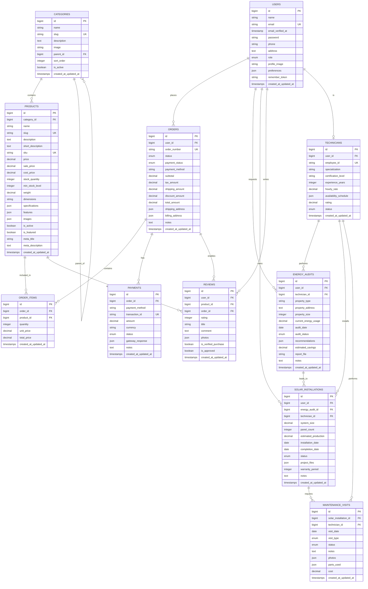

# BabiEnergies - Visual Entity Relationship Diagram

## Database Schema Visualization

## Key Relationships Summary

### E-commerce Flow:
1. **Users** place **Orders** containing **Order Items** (Products)
2. **Orders** have **Payments** for transaction processing
3. **Users** can write **Reviews** for **Products** they've purchased
4. **Products** belong to **Categories** (hierarchical structure)

### Energy Services Flow:
1. **Users** request **Energy Audits** performed by **Technicians**
2. **Energy Audits** can lead to **Solar Installations**
3. **Solar Installations** require **Maintenance Visits** by **Technicians**
4. **Technicians** are specialized users who perform energy services

### Cross-Functional Integration:
- **Users** can be both customers (e-commerce) and service recipients (energy services)
- **Technicians** are specialized users who provide energy services
- **Orders** can include both products and services
- **Reviews** can cover both products and services

## Business Logic Flow

### Customer Journey:
1. **Registration** → User creates account
2. **Browsing** → User browses products by category
3. **Shopping** → User adds products to cart and places order
4. **Payment** → User pays for order
5. **Review** → User reviews purchased products
6. **Energy Services** → User books energy audit and solar installation
7. **Maintenance** → User receives ongoing maintenance services

### Admin/Technician Journey:
1. **Management** → Admin manages products, categories, orders
2. **Service Delivery** → Technician performs energy audits and installations
3. **Maintenance** → Technician provides ongoing maintenance services
4. **Reporting** → System generates reports and analytics

This ERD provides a comprehensive foundation for the BabiEnergies platform, supporting both e-commerce and energy services functionality while maintaining data integrity and supporting business growth.
